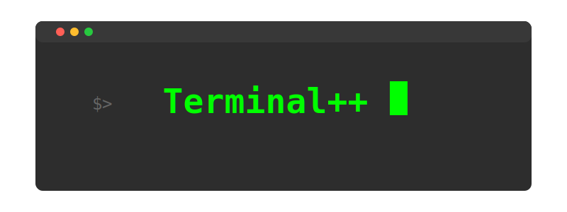

# Terminal++

<div align="center">
  
</div>

A lightweight, cross-platform C++ library for creating rich terminal applications with color support, cursor
manipulation, and asynchronous operations.
Works seamlessly on Windows and UNIX-like systems.

## Table of contents

- [Installation](#installation)
- [Basic Usage](#basic-usage)
- [Text Styling](#text-styling)
- [Colors](#colors)
- [Terminal Operations](#terminal-operations)
- [Input Handling](#input-handling)
- [Asynchronous Operations](#asynchronous-operations)
- [Reference Charts](#reference-charts)

## Installation

Include the header file in your project:

```c++
#include "Terminal.hpp"
```

Compile with:

```bash
g++ -std=c++17 your_file.c++ -o your_program
```

No special setup or configuration is required.

## Basic usage

Basic printing operations:

```c++
printer.println("Hello, Terminal++!");
```

Chain multiple operations:

```c++
printer.setTextColor(Color::Blue)
    .setBackgroundColor(Color::White)
    .println("Styled text!");
```

## Text styling

Available text styles through the `TextStyle` class:

- `TextStyle::Normal` - Default text style
- `TextStyle::Bold` - Bold weight text
- `TextStyle::Dim` - Dimmed text intensity
- `TextStyle::Italic` - Italic text
- `TextStyle::Underline` - Underlined text
- `TextStyle::Blink` - Blinking text
- `TextStyle::Reverse` - Reversed foreground/background colors
- `TextStyle::Hidden` - Hidden text
- `TextStyle::Strike` - Strikethrough text

[Text styles Reference](#text-styles)

## Colors

### Basic colors

Available through the `Color` class:

- `Color::Black`
- `Color::Red`
- `Color::Green`
- `Color::Yellow`
- `Color::Blue`
- `Color::Magenta`
- `Color::Cyan`
- `Color::White`
- `Color::Reset` - Resets both text and background colors to terminal defaults

### 8-bit colors

Use any color from 0 to 255:

```c++
printer.setTextColor(42)        // Text color
     .setBackgroundColor(200); // Background color
```

[8-bit Color Reference Chart](#8-bit-color-chart)

### RGB colors

```c++
printer.setTextColor(Color::Rgb(94, 60, 108)) // purple color
       .println("Termina++ in purple!");
```

## Terminal operations

### Screen control

Clear operations available through `ClearType` enum:

- `ClearType::All` - Clear screen and history
- `ClearType::Purge` - Clear visible screen only
- `ClearType::Line` - Clear current line

Example:

```c++
Terminal::clearScreen(ClearType::All);
```

### Cursor control

#### Move cursor

```c++
Cursor::moveTo(10, 5);
```

Coordinates start at [1, 1] in the top-left corner of the terminal.

#### Hide cursor

```c++
Cursor::hideCursor();
```

#### Show cursor

```c++
Cursor::showCursor();
```

## Cursor styles

- `Cursor::Default` - the default cursor shape used by the user
- `Cursor::BlinkingBlock` - a blinking block `█`
- `Cursor::SteadyBlock` - a non blinking block
- `Cursor::BlinkingUnderline` - a blinking underline `_`
- `Cursor::SteadyUnderline` - a non blinking underline
- `Cursor::BlinkingBar` - a blinking bar `|`
- `Cursor::SteadyBar` - a non blinking bar

Change cursor style

#### Example:

```c++
Cursor::setStyle(Cursor::BlinkingUnderline);
```

## Terminal information

#### Get size

```c++
auto [width, height] = Terminal::size();
```

#### Check resize

```c++
if (term.isResized()) {/*Handle resize*/}
```

#### Get new dimensions

```c++
int newWidth, newHeight;
term.isResized(newWidth, newHeight);
```

#### Window title

```c++
Terminal::setTitle("My Terminal App");
```

#### Sleep operation

```c++
Terminal::sleep(1000); // Sleep for 1 second
```

#### Terminal reset

```c++
Terminal::reset();
```

Resets all the terminal's attributes

## Input handling

### Supported keyboard buttons

- **Backspace**: `keyCode::Backspace`
- **Enter**: `keyCode::Enter`
- **Escape**: `keyCode::Esc`
- **Tab**: `keyCode::Tab`
- **Space**: `keyCode::Space`
- **ArrowKeys**

### Input methods

#### Read single character

```c++
char c = Input::getChar();
```

Gets a character from unbuffered input.

#### Read a string

```c++
std::string str = Input::getString("Enter text: ");
```

#### Read a line

```c++
std::string line = Input::getLine("Enter a line: ");
```

#### Check key press

```c++
if (Terminal::keyPressed()) {/*Handle key press*/}
```

## Asynchronous operations

Run background task:

```c++
term.nonBlock([]() {
    printer.println("Processing...")
           .setTextColor(Color::Green)
           .println("Task complete!");
    Terminal::sleep(1000);
});
```

Wait for completion [optional]:

```c++
term.awaitCompletion();
```

All background threads are automatically joined when the Terminal instance is destroyed.

## Reference charts

### Text styles

<div align="center">
  
</div>

### 8-bit color chart

<div align="center">
  
</div>

## Examples

For complete working examples - see the [examples](src/examples) directory

## License

This project is licensed under the Apache 2.0 License - see the [LICENSE](LICENSE) file for details.
